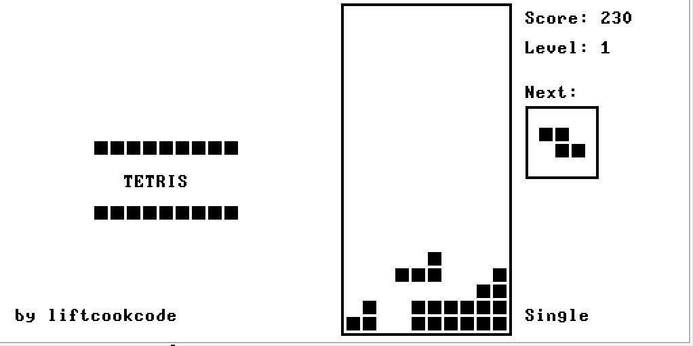

### This is a tetris-like game built in the Jack programming language. It runs on a VM emulator desgined by Noam Nisan, Shimon Schoken, and the rest of the Nand2Tetris team at "nand2tetris.org". 

#### Secondly, all credit goes to "https://github.com/fursich". What an amazing experience to build a classic game from scratch!

GETTING STARTED:
To run this game you'll need to install VM Emulator or JVM
1. Install Java
2. Download the official (Nand2Tetris Software Suite) - https://www.nand2tetris.org/software
3. Run VMEmulator.sh
4. Click [File] -> [Load Program] -> select source/Tetris of this repository -> Press [Load Program]
5. When confirming message pops up, press "Yes" (for better game speed, master brand relies on the build-in OS)
6. Set [Animate] select box as "No animation", and press [>>] button
7. Hit the enter key to start
8. You're all set!
9. to restart hit [<<] key and then [>>] 

HOW TO PLAY:
* Start -> Enter Key 
* Move Left -> Left Arrow Key 
* Move Right -> Right Arrow Key 
* Rotate Clockwise -> Z key 
* Rotate Counter-Clockwise -> Up Arrow Key 
* Soft Drop -> Down Arrow Key 
* Hard Drop -> Space Bar

FOR COMPILATION:
For re-compilation of the source code you'll need a Jack compiler. A working one can be found [here](https://github.com/liftcookcode/nand2tetris/tree/main/projects/11).

